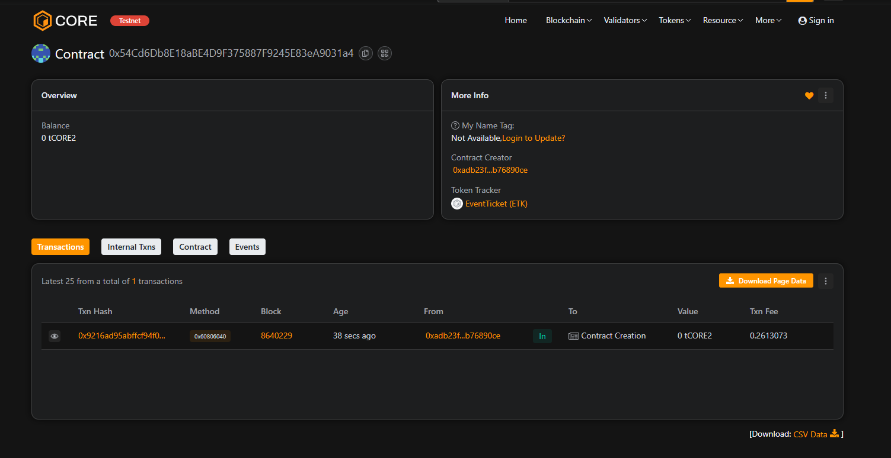

# NFT-Based Event Ticketing System

## Project Description
This project implements a blockchain-based event ticketing system where tickets are represented as **NFTs (ERC721 tokens)**. It ensures authenticity, prevents duplication, and enables transparent resale of tickets.

## Project Vision
To revolutionize the ticketing industry by leveraging blockchain technology, ensuring **fraud-free, transparent, and easily transferable** digital tickets for events.

## Key Features
-  **NFT Tickets**: Each ticket is minted as a unique NFT.
-  **Direct Purchase**: Users can buy tickets directly from the organizer.
-  **Secure Funds**: Event organizers can withdraw collected funds safely.
-  **Event Transparency**: Anyone can view event details on-chain.

## Future Scopes
-  **Ticket Resale Marketplace**: Allow peer-to-peer resale of NFT tickets with royalty to event organizers.
-  **Dynamic Pricing**: Implement variable pricing models based on demand.
-  **Multi-Event Support**: Enable multiple events within the same contract.
-  **Integration with QR/Barcode** : For seamless event entry and verification.

## Contract Details
0x54Cd6Db8E18aBE4D9F375887F9245E83eA9031a4

